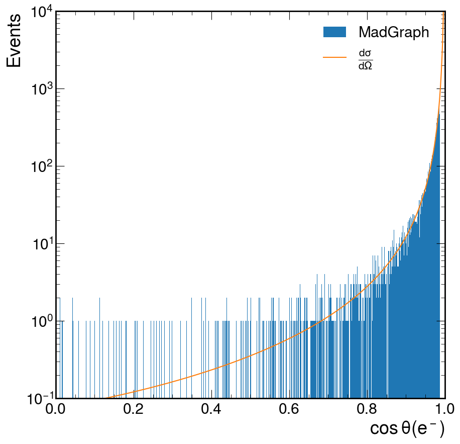
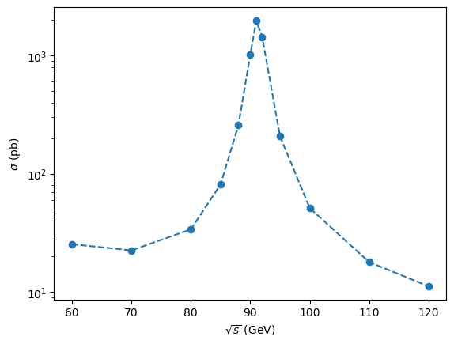
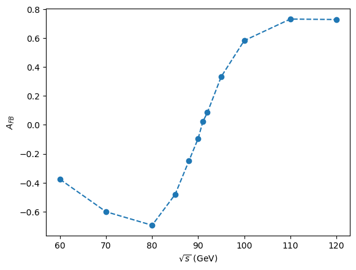

# 2. MadGraph Bhabha scattering $e^+e^- \to e^+e^-$ (20 points).
The differential cross section for Bhabha scattering in QED in the high-energy limit can be written in terms of the Mandelstam variables $s = (p_1 + p_2)^2$, $t = (p_1-p_3)^2$, and $u = (p_1-p_4)^2$,

$$
\frac{d\sigma}{d\Omega} = \frac{\pi \alpha^2}{s}\left [ u^2\left (\frac{1}{s} + \frac{1}{t}\right)^2 +  \left(\frac{t}{s}\right)^2 +  \left(\frac{s}{t}\right)^2 \right ]~.
$$

Note that if we ignore the electron mass, $s + t + u = 0$. 

## a. (5 points) 
**Rewrite this formula in terms of $s$ and $\cos\theta$.**

We ought to know that at high energies, 

$$
\begin{align}
t &= (p_{1}-p_{1}^\prime)^2 \\
&\approx -2 p_{1} \cdot p_{1}^\prime \\
&= -2 | \vec{p_{1}}| | \vec{p_{1}}^\prime| (1-\cos{\theta})
\end{align}
$$

Since we're in the center of mass frame we can reasonably define

$$
\vec{p_{1}} = E [1, 0, 0, 1] \to |\vec{p_{1}}|=E.
$$

And since we're doing $e^+e^- \to e^+e^-$, we can also assume $|\vec{p_{1}}|=|\vec{p_{1}}^\prime|=E$. We also ought to know that $s\approx4E^2$ at high energy. Altogether this gets us

$$
t = -\frac{s}{2}(1-\cos{\theta}).
$$

Jamming this stuff into $s+t+u=0$ we get an expression for $u$:

$$
u=-\frac{s}{2}(1+\cos \theta).
$$

One thoroughly jammed, we can move onto plugging into the differential cross-section, which according to Mathematica turns out to be,

$$
\frac{d\sigma}{d\Omega} = \frac{\pi  \alpha ^2 (\cos (2 \theta )+7)^2}{8 s (\cos (\theta )-1)^2}.
$$


## b. (5 points) 
**What feature of the diagrams causes the differential cross section to diverge as $\theta\to 0$?** 

As $\theta \to 0$, $t \to 0$, and so the momentum transfer approaches zero.

**Why didn't we see this for $e^+e^-\to \mu^+\mu^-$?**

My guess is that the momentum transfer does not approach zero in this case.

## c. (10 points) 

Generate 10,000 events using MadGraph (excluding the $Z$ boson exchange diagram) at $\sqrt{s}=1$TeV. 
Plot the resulting distribution as a function of $\cos\theta$ and compare to the theoretical expectation.



**What difference(s) do you observe?**

There's no divergence in the MadGraph, probably because there's some sort of cutoff.


# 3. MadGraph vs. ALEPH experimental results (20 points).

**Using MadGraph, reproduce the experimental results from the ALEPH Collaboration, i.e. the total (inclusive) cross section $\sigma$ and forward-backward asymmetry $A_\mathrm{FB}$ of the muons as a function of $\sqrt{s}$ in the process $e^+e^-\to\mu^+\mu^-$.**

**You will need to run MadGraph at a series of $\sqrt{s}$ values, so you will need to edit the `runcard.dat` directly. Of course, both $Z$ boson and $\gamma$ exchange diagrams need to be included.**

**The forward-backward asymmetry is a measure of how many the imbalance between the forward and the backward directions:**

$$
A_\mathrm{FB} = \frac{\sigma(\cos\theta>0) - \sigma(\cos\theta < 0)}{\sigma(\cos\theta > 0) + \sigma(\cos\theta < 0)}
$$

**For $e^+e^-\to\mu^+\mu^-$, this quantity is nonzero in the standard model because of the chiral couplings of the $Z$ boson.**

**In particular, generate 1,000 events at $\sqrt{s} = 60$, 70, 80, 85, 88, 90, 91, 92, 95, 100, 110, and 120,GeV. Plot $\sigma$ and $A_\mathrm{FB}$ versus $\sqrt{s}$ and compare to the data.**

The peak $\sigma$ at 90 GeV matches with Aleph, which is a good sign.




The "zeroness" of the $A_{FB}$ at 90 GeV matching that of Aleph is also a good sign.




# 4. $e^+ e^-\to e^+ e^-$ at NLO in QED (10 points).

## a. Draw all the LO and NLO in QED diagrams for $e^+ e^-\to e^+e^-$.  How many are there in total?

The simplest thing I can do to the s-channel is replace an electron/positron edge with an $e^{\pm} \to e^{\pm}\gamma \to e^{\pm}$ diagram, or I can replace the $\gamma$ edge with a $\gamma \to e^+e^-\to \gamma$ diagram.
So I can make a single change on one of the 5 edges in the $e^+ e^-\to e^+e^-$, leaving us with 5 NLO diagrams for the s-channel. 
Similarly for the t-channel, leaving us with a total of 10 NLO diagrams and 2 LO diagrams.

## b. Use MadGraph to generate the diagrams up to NLO order in QED.
**The MadGraph syntax for this is:**
```bash
generate <process> / <excluded particles> [QED]
```

The syntax that I ended up doing after downloading and extracting [loop_qcd_qed_sm](http://madgraph.phys.ucl.ac.be/Downloads/models/loop_qcd_qed_sm.tgz): 

```sh
convert model ./loop_qcd_qed_sm
import ./loop_qcd_qed_sm/
generate e+ e- > e+ e- / g ghg ghg~ u c d s b u~ c~ d~ s~ b~ gha gha~ ve vm vt mu- ta- ve~ vm~ vt~ mu+ ta+ t t~ z w+ ghz ghwp ghwm h g0 g+ w- ghz~ ghwp~ ghwm~ g- [QED]
```

However, this get's me a bunch of explicitly, non-loop diagrams, with an added absorbed or emitted photon. 
Makes me feel like I did not properly exclude everything. 
Maybe I didn't properly exclude ghosts?

Anyways, there were 24 NLO diagrams generated in total.