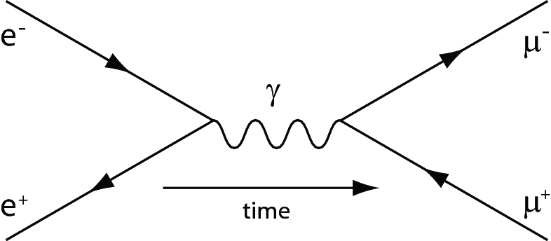

### 1. **QED $e^+e^- \to\mu^+\mu^-$** \[Bonus Problem\] (10 points)

Starting with the Feynman diagram for $e^+e^-\to\mu^+\mu^-$ and the Feynman rules laid out in the lecture, calculate the spin-averaged differential cross section in the high-energy limit:
$$
\frac{d\sigma}{d\Omega} = \frac{\alpha^2}{4E_\mathrm{cm}}(1+\cos^2\theta)~.
$$

