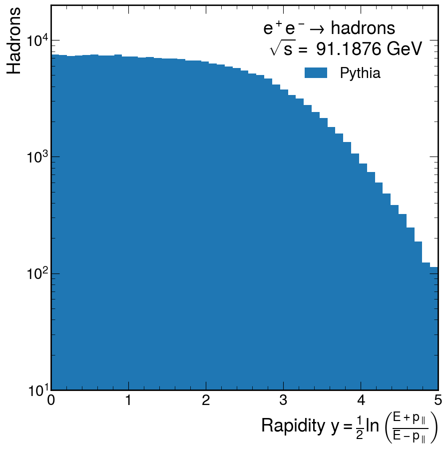

# 1. Hadronization: Rapidity plateau (20 points).

**When quarks and gluons fragment into jets, the soft particles created during the fragmentation process are produced in colored flux tubes. This means they have limited transverse momentum with respect to the *jet axis* and that they are produced uniformly in longitudinal phase space. A consequence of this is that production is uniform in rapidity**

$$
y = \frac{1}{2}\ln\left(
    \frac{
        E+p_{||}
        }{
        E-p_{||}
    } 
\right)~,
$$

**where $p_{||}$ is the particle's momentum with respect to the jet axis.**

## a. ✅

**Show that a particle’s rapidity is related to its velocity along the jet axis $\beta_{||}$ by the expression**

$$
y = \tanh^{-1}(\beta_{||})~.
$$

We know first off that $E=\gamma m$ and $p_{||}=\gamma \beta_{||} m$.
After subbing in and cancelling line terms, we get

$$
y = \frac{1}{2}\ln\left(
    \frac{
        1 + \beta_{||}
        }{
        1 - \beta_{||}
    } 
\right) = \tanh^{-1}(\beta_{||})~.
$$

## b.  ❌

**Show that the rapidity difference between two particles in a jet is invariant with respect to Lorentz boosts along the jet direction.**

The boost factor always cancels in the logarithm, so there will never be a dependance of boost on the rapidity.

==I forgot basic relativity.
But I think I was pretty close.
The rapidity $y$ has the property that changes in boost change the rapidity by a constant.
Same boost produces the same change by a constant.
The upshot is that differences between rapidities boosted by the same parameter are left invariant.==

## c. ✅

**Show that in the limit where particle masses can be neglected the rapidity y can be approximated by the expression**

$$
y \approx - \ln(\tan(\theta/2)),
$$

**where $\theta$ is the angle the particle makes with respect to the jet axis.**

If massless, then $E=p$.
Keeping the following trig identity in mind

$$
\frac{\cos \theta - 1 }{\cos \theta + 1} = \tan^2(\theta/2),
$$

then,

$$
\begin{align}
y  & = \frac{1}{2}\ln\left(
    \frac{
        p + p_{||}
        }{
        p - p_{||}
    } 
\right) \\
& = \frac{1}{2}\ln\left(
    \frac{
        1 + \cos \theta
        }{
        1 - \cos \theta
    } 
\right) \\
& = -\ln\left(
    \tan(\theta/2) 
\right)~.
\end{align}
$$

## d. ❌

**Consider $e^+e^- \to$ hadrons in the center-of-mass frame where the energies of the initial $e^+$ and $e^−$ beams are $E_{beam} = E_{CM}/2$.
The distribution of particles will be approximately uniform in $y$ between a minimum value $y_{min}$ and a maximum value $y_{max}$ where $y_{min} = - y_{max}$.
Using the definition of rapidity above, find an approximate value for $y_{max}$ for hadrons of species $h$ and mass $m_{h}$ as a function of $E_{beam}$.**

$$
y = \frac{1}{2}\ln\left(
    \frac{
        1 + \cos \theta
        }{
        1 - \cos \theta
    } 
\right)
$$

$$
y = \frac{1}{2}\ln\left(
    \frac{
        E+p_{||}
        }{
        E-p_{||}
    } 
\right)
$$

I think I'm confused on how to find $p_{||}$, but I'm pretty sure it'll end up being something to do with the ratio between $E_{CM}$ and $m_{h}$.

==Brilliant observation on my part...
Maximum rapidity happens at maximum mass energy, which is $E_{beam}=E_{CM}/2$.
Then to first order==

$$
\begin{align}
p_{||}^{max} &  = \sqrt{ \frac{E_{CM}^2}{4}-m_{h}^2 } \\
	        & \approx \frac{E_{CM}}{2}\left( 1-\frac{2m_{h}^2}{E_{CM}^2} \right).
\end{align}
$$

==Then after plugging in==

$$
\begin{align}
y_{max} & =\frac{1}{2}\ln\left( \frac{E_{CM}/2 + p_{||}^{max}}{E_{CM}/2 - p_{||}^{max}} \right)\\

& \approx \frac{1}{2}\ln\left( \frac{1-\cancel{\frac{m_{h}^2}{E_{CM}^2}}}{\frac{m_{h}^2}{E_{CM}^2}} \right) \\

& \approx \ln \left( \frac{E_{CM}}{m_{h}} \right)
\end{align}
$$


## e. ❌

**Using this result, show that the average multiplicity of final state hadrons $h$ of mass $m_{h}$ is**

$$
n_{h}\propto \log\left( \frac{E_{CM}}{m_{h}} \right)~.
$$

**In other words, the multiplicity of hadrons grows logarithmically with the center-of-mass energy.**

In order to solve this, I would need to have done the last problem.

==That^ wasn't actually true apparently.==
==Hadrons created by the flux tube between two departing quarks are distributed uniformly in the longitudinal direction.
Thus the integral of the distribution is only dependent on the boundaries, $y_{max}=-y_{min}$, and difference between rapidities is invariant under boosts, we can safely say that the multiplicity $n_{h}$ can be expressed just by it's proportionality to $y_{max}$.==

# 2. Hadronization: Fragmentation functions (20 points).

**The fragmentation function $D_{q}^h(z)$ is defined as the probability that a quark $q$ will hadronize to produce a hadron of species $h$ with energy fraction between $z$ and $z + dz$. These fragmentation functions must satisfy conservation of momentum and unitarity so that**

$$
\begin{align}
\sum_{h}\int_{0}^1 z D_{q}^h(z)~dz  & = 1 \\
\sum_{h}\int_{z_{min}}^1 D_{q}^h(z)~dz  & = \sum_{h}n_{h}
\end{align}
$$

**where the sum is over all hadron species, $z_{min} = m_{h}/E_{q}$ with $m_{h}$ the hadron mass and $E_{q}$ the quark energy, and $n_{h}$ is the average number of hadrons of type $h$ produced by the fragmentation of the quark.**

**Fragmentation functions are often parameterized as**

$$
D_{q}^h(z)=\mathcal{N}\frac{(1-z)^\alpha}{z}
$$

**where $\alpha$ and $\mathcal{N}$ are constants.**

## a. ✅

**Show that**

$$
\mathcal{N}=(\alpha+1)\braket{z} 
$$

**where $\braket{z}$ is the average fraction of the quark momentum carried by hadrons of type h after fragmentation.**

Just plugging into unitarity

$$
\begin{align}
\sum_{h}\int_{0}^1 \mathcal{N}(1-z)^\alpha ~dz  & = 1 \\
\frac{1}{\braket{z}}\frac{\mathcal{N}}{\alpha+1} & = 1 \\
\mathcal{N} & = (\alpha+1)\braket{z} 
\end{align}
$$

## b. ❌

**Show that this formalism reproduces the previous result**

$$
n_{h}\propto \log\left( \frac{E_{CM}}{m_{h}} \right)~.
$$

**for the process $e^+e^- \to 2$ jets.**

This will involved momentum conservation.

==Yeah, this was easy, I'm not sure why I didn't think so when I tried it.
It's just a matter of plugging in $D_{q}^h(z)$, solving the integral, and assuming we're in the massless regime.==

# 3. Hadronization in $e^+e^- \to$ hadrons with `PYTHIA8.3` (30 points).

## a. ❌

Generate 10,000 events in `PYTHIA8.3` $e^+e^- \to$ hadrons events on the Z pole.
Hint: In Python, this should look like the following

This is the script I tried but kept getting errors for:

```python
import pythia8

# Set up Pythia instance
pythia = pythia8.Pythia()

# Configure Pythia to generate e+e- to hadrons
pythia.readString("PDF:lepton = off")
pythia.readString("WeakSingleBoson:ffbar2gmZ = on")
pythia.readString("23:onMode = off")
pythia.readString("23:onIfAny = 1 2 3 4 5")
pythia.readString("Beams:idA =  11")
pythia.readString("Beams:idB = -11")

mZ = pythia.particleData.m0(23)
pythia.settings.parm("Beams:eCM", mZ)

# Initialize Pythia
pythia.init()

# Number of events to generate
nEvents = 10000

# Event loop
for iEvent in range(nEvents):
    # Generate event
    pythia.next()

pythia.stat("Beams:idA")
pythia.stat("Beams:idB")
pythia.stat("Beams:eCM")
pythia.stat("23:onIfAny")
pythia.stat("ParticleData:initialize")

pythia.stat()
```

==I have commented the solution code to the best of my ability.==
==I have also added the resulting histogram.==

```python
import matplotlib.pyplot as plt                    # Import the matplotlib library for plotting
import pythia8                                     # Import the Pythia event generator
import numpy as np                                 # Import the NumPy library for numerical operations
import mplhep as hep                               # Import the mplhep library for plot styling

plt.style.use(hep.style.CMS)                       # Set the plotting style to CMS style

pythia = pythia8.Pythia()                          # Create an instance of the Pythia event generator

pythia.readString("PDF:lepton = off")              # Configure Pythia to generate e+e- to hadrons
pythia.readString("WeakSingleBoson:ffbar2gmZ = on")
pythia.readString("23:onMode = off")
pythia.readString("23:onIfAny = 1 2 3 4 5")
pythia.readString("Beams:idA =  11")
pythia.readString("Beams:idB = -11")

mZ = pythia.particleData.m0(23)                    # Get the mass of the Z boson
print(f"Center of mass energy: {mZ} GeV")
pythia.settings.parm("Beams:eCM", mZ)              # Set the center of mass energy of the collision

pythia.init()                                      # Initialize the Pythia event generator

def dot(p1, p2):
    """Dot product of two Pythia particles"""
    return p1.px() * p2.px() + p1.py() * p2.py() + p1.pz() * p2.pz()

def dtheta(p1, p2):
    """Angular distance between two Pythia particles"""
    return np.arccos(dot(p1, p2) / p1.pAbs() / p2.pAbs())

def y(p1, p2):
    """Rapidity of p1 with respect to p2"""
    return 0.5 * np.log((p1.e() + dot(p1, p2) / p2.pAbs()) / (p1.e() - dot(p1, p2) / p2.pAbs()))

n_events = 10000                                   # Number of events to generate
rapidity = []                                      # List to store rapidity values

for i in range(n_events):
    if not pythia.next():                          # Generate the next event in Pythia
        continue
    
    event = pythia.event                            # Get the event information
    hadrons = []                                    # List to store final-state hadrons
    partons = []                                    # List to store partons
    
    for i in range(1, event.size()):
        if event[i].isFinal() and event[i].isHadron():
            hadrons.append(event[i])                 # Select and store final-state hadrons
        elif event[i].status() == -23:
            partons.append(event[i])                 # Select and store partons
    
    for hadron in hadrons:
        closest = np.argmin([dtheta(hadron, parton) for parton in partons])
        rapidity.append(y(hadron, partons[closest])) # Compute and store rapidity values

plt.hist(rapidity, bins=np.linspace(0, 5, 50), label="Pythia")  # Plot the rapidity distribution
plt.semilogy()                                                 # Set y-axis to logarithmic scale
plt.ylabel("Hadrons")                                          # Set y-axis label
plt.xlabel(r"Rapidity $y=\frac{1}{2}\ln\left(\frac{E+p_{\parallel}}{E-p_{\parallel}}\right)$")  # Set x-axis label
plt.xlim(0, 5)                                    # Set the x-axis limits
plt.ylim(10, 2e4)                                # Set the y-axis limits
plt.legend(title="$e^+e^- \\to$ hadrons \n $\\sqrt{{s}}=$ {} GeV".format(mZ))  # Add a legend to the plot
plt.savefig("rapidity.pdf")                       # Save the plot as a PDF file

pythia.stat()                                     # Print statistics and clean up Pythia instance
```


