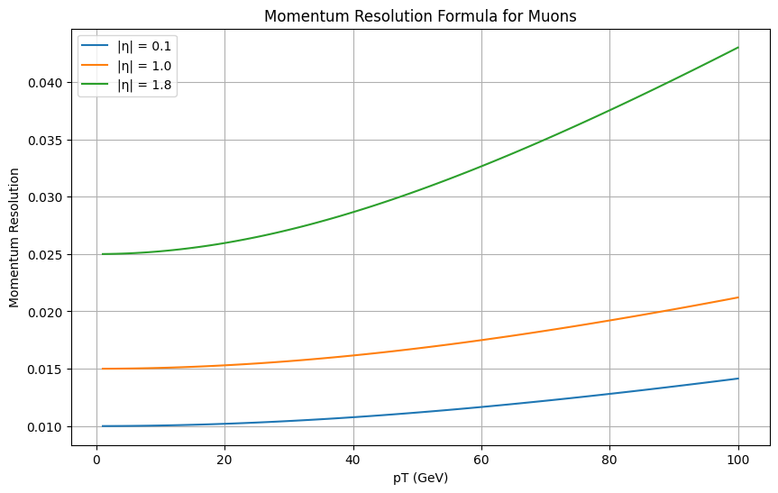
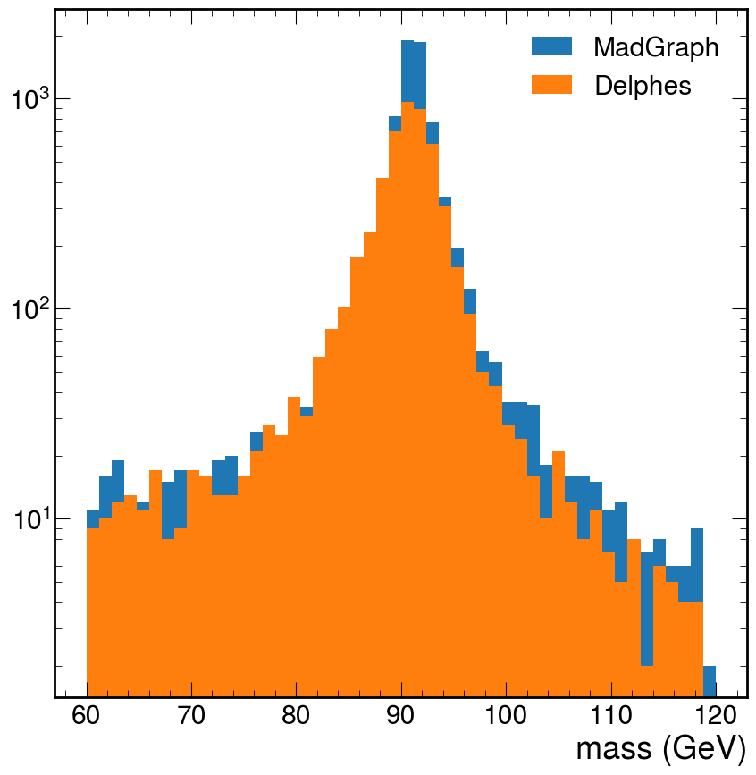
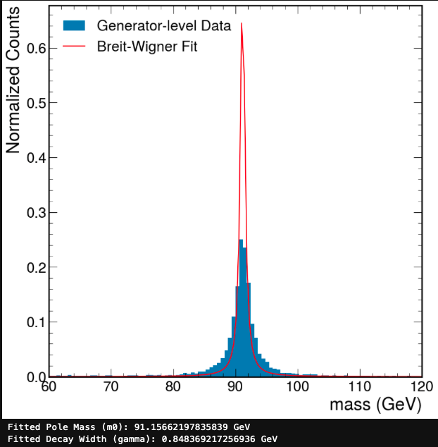
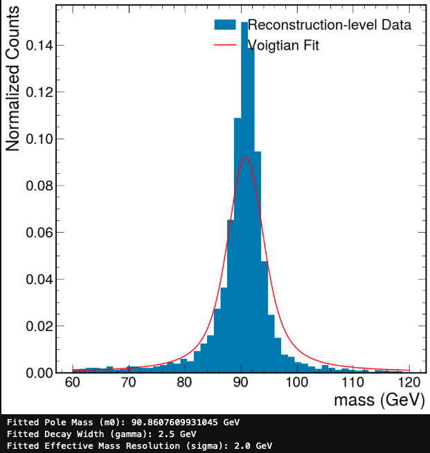
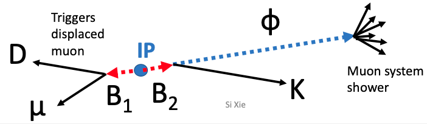
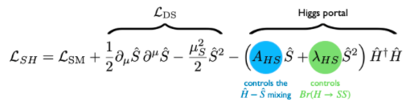
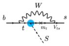

# 1. DELPHES: Generator-level vs. reconstruction-level (20 points)

**In this problem, we will investigate the effect of the parameterized detector effects in Delphes.
First, generate 10,000 Drell–Yan $pp\to \mu \mu$ events at $\sqrt{s}=$ 13 TeV assuming only standard model interactions with Pythia+MadGraph+Delphes.**

Since I'm having so many technical issues, I will put the steps that I input here for my future reference.
The solution will be labelled as such.

For this homework I had to log into lxplus.

And in case I need to, or otherwise forget, clone the class repo.

```sh
git clone https://github.com/jmduarte/phys239
```

The steps for this analysis are:
1. generate particles in `madgraph`
2. shower them in `pythia`
3. simulate their interactions with the detector with `delphes`

The first two steps are done with `madgraph` with pythia turned on.

We can't use docker on UAF nor on LPC, on LPC singularity creates the container in a location where I am not allocated enough space, and on UAF has permission issues with pythia and madgraph. 
Oh, and the container given in the repo's readme doesn't work on apple silicon :)))))).
Delphes didnt even begin to compile on LPC.
This was a nightmare.

I was FINALY able to run madgraph, install pythia, and compile delphes on lxplus by manually installing madgraph.

```sh
cd ~/nobackup
mkir madgraph
wget https://launchpad.net/mg5amcnlo/3.0/3.5.x/+download/MG5_aMC_v3.5.0.tar.gz
tar -xf MG5_aMC_v3.5.0.tar.gz
```

Then after running madgraph,

```sh
./MG5_aMC_v3_5_0/bin/mg5_aMC
```

I installed madanalysis5, pythia8, and delphes.

```sh
install MadAnalysis5
install pythia8
install Delphes
```

When installing Pythia, it might ask you to install an extra dependancy.
Just make sure to answer yes.

To make things a little easier, I will make a little `madgraph` setup script called `drell-yan.mg5`.

```sh
generate p p > mu+ mu-
output drell-yan
launch
   shower=Pythia8
   detector=Delphes
   set nevents 10000
   set ebeam1 6500
   set ebeam2 6500
```

Then we run 

```sh
./MG5_aMC_v3_5_0/bin/mg5_aMC drell-yan.mg5
```

Finally, after all the kicking and screaming, I have finally produces the required root file, which we should be able to find in `/drell-yan/Events/run_01`.

## a. 

**Plot the momentum resolution formula for muons used in Delphes.
Note that there are three separate |η| bins.
Plot all three on the same canvas from pT = 1 to 100 GeV.**



**What is the approximate range of momentum resolution values?**

.01 to .041

## b.

**Plot the invariant mass of the two leading-pT generator-level muons and compare it to the invariant mass of the two leading-pT reconstructed muons.
Which distribution is wider?**

If these were unit normalized the madgraph one would be wider.



## c.

**The generator-level distribution approximately follows a Breit-Wigner (or Cauchy) distribution.
Fit the generator-level data to this distribution and extract the pole mass and decay width of the Z boson.**


Decay width seems wrong.

## d.
**The reconstruction-level distribution should approximately follow the convolution of a Breit-Wigner and a Gaussian, known as a Voigtian. 
Fit the reconstructor-level data to this distribution and extract the pole mass, decay width of the Z boson, and the overall effective mass resolution.**



**Does it make sense given the formulas?**

I'm not sure what is meant by "the formulas" here.

# 2. Single-bin counting experiment and $s/\sqrt{b}$ (20 points).

In this problem, you will derive the figure of merit "$s/\sqrt{b}$" as a measure of expected discovery significance.
For a single-bin counting experiment, with expected (known) signal $s$ and background $b$, the likelihood is given by

$$
L(\mu)=\frac{(\mu s+b)^n}{n!}e^{-(\mu s+b)},
$$

where $\mu$ is the signal strength (and "parameter of interest") and there are no nuisance parameters (because $s$ and $b$ are taken to be known).
As shown in class, the corresponding maximum likelihood estimate for $\mu$ is $\hat{\mu}=(n-b)/s$.

For the usual case where the signal models correspond to positive $\mu$, one may test the $\mu=0$ (background-only) hypothesis with the test statistic $q_{0}$ where

$$
q_{\mu}=
\begin{cases}
	-2\ln \frac{L(\mu)}{L(\hat{\mu})} & \hat{\mu}\geq 0 \\
	0 & \hat{\mu} < 0
\end{cases}
$$

## a. 

**In the large-sample limit, the discovery significance is given by $Z_{0}=\sqrt{q_{0}}$.**
**Assuming this, show that**

$$
Z_{0}=\sqrt{2(n\ln\frac{n}{b}+b-n)}
$$

Just plugging in $\hat{\mu}$ in $L(\hat{\mu})$ and setting $\mu=0$ in $q_{\mu}$, we get

$$
\begin{align}
\sqrt{ q_{0} } 
 & = \sqrt{ 2[\ln [L((n-b)/s)] - \ln(L(0))]} \\
 & = \sqrt{ 2\left[ \ln \left(\frac{e^{-n}n^n}{\cancel{n!}} \right) - \ln\left( \frac{b^ne^{-b}}{\cancel{n!}} \right) \right]}  \\
 & = \sqrt{2(n\ln\frac{n}{b}+b-n)}
\end{align}
$$

## b.

**To approximate the median expected discovery significance $\mathbb{E}(Z_{0}|\mu=1)$, we can simply replace $n$ with the expected value $\mathbb{E}(n|\mu = 1) = s + b$ (the so-called “Asimov data set”).
Show that if you make this replacement and take the limit $s \ll b$, you arrive at**

$$
\mathbb{E}(Z_{0}|\mu=1) \approx \frac{s}{\sqrt{ b }}
$$

We get that 

$$
Z_{0} \approx \sqrt{2\left( (s+b)\ln \left[ \frac{s+b}{b} \right] - s \right)}
$$

If we set $s \to \epsilon b$, where $\epsilon$ is some small parameter,

$$  
Z_{0} \approx \sqrt{2 \left((b \epsilon +b) \ln \left(\frac{b \epsilon +b}{b}\right)-b \epsilon \right)}
$$

Then expand about $\epsilon=0$,

$$
Z_{0}\sim\sqrt{b}\epsilon+O\left(\epsilon ^2\right)
$$

and resetting $\epsilon\to s/b$, we get

$$
Z_{0}\sim \frac{s}{\sqrt{ b }}.
$$


# 3.

**Propose your final project in one or two paragraphs. The basic idea is to generate and simulate a new physics model and approximately estimate the sensitivity with a simple data analysis at the LHC.**

* Physics Motivation

The physics motivation behind the LLP search with B-Parking dataset lies in the quest to uncover new particles and interactions that have eluded detection in previous studies.
LLPs, specifically light Feebly Interacting Particles (FIPs), are of particular interest.
These LLPs, which have low masses (less than 10 GeV), have the potential to provide insights into key challenges in High-Energy Physics (HEP).

* New Physics Model and Experimental Signature

In the context of the present study, the focus lies specifically on flavor-changing decays.
More precisely, we investigate the flavor-changing decay process: $B\to \phi K$, where $\phi$ denotes the LLP.



The production of such flavor-changing decays primarily occurs via the away-side $B$ meson.
Subsequently, the LLP undergoes decay, resulting in the generation of a muon system shower, which serves as the experimental signature for our investigation.
By scrutinizing the properties and characteristics of this muon system shower, we seek to uncover potential evidence of the sought-after flavor-changing decays.

* software usage

We plan to generate and shower the following model in pythia, (where $\lambda_{HS}=0$)





then use a modified version of Delphes to simulate interactions in the detector which includes displaces showers.

* Background consideration

The background estimation is data driven. It will be extrapolated from verification regions to the signal region using something called the alphabet method.

