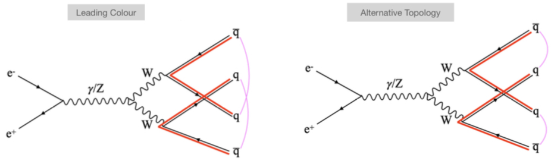
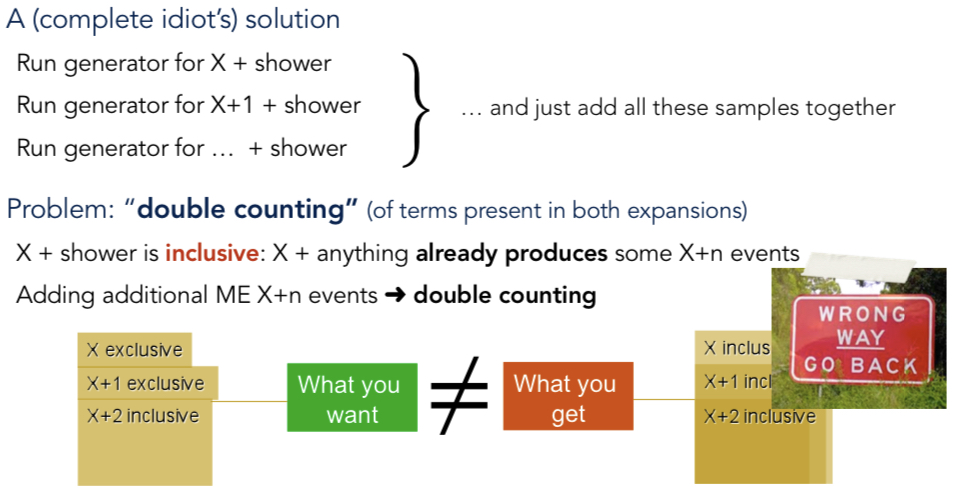
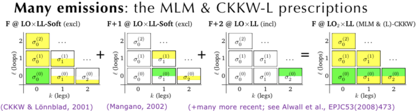

# Parton showers & hadronization

## Length/time Scales
* 3 TeV e+e− → qq event is generated with Pythia8
* Event is clustered with with the e+e− generalized-kT algorithm with p = 0.5 in FastJet (gives a clustering sequence that is ordered in time)
* Clustering sequence is sampled at different times to represent particles as traces.
* Initial particles are yellow traces, intermediate particles are shown in blue, final particles (mostly hadrons) are in red. Brighter lines have higher energy.

Animation found [here](https://gsalam.web.cern.ch/gsalam/panscales/videos.html). Extremely neat.

## Energy scales

## Schematic of a $pp \to t \bar{t}$ event

* Hard scattering process 
* Final/initial-state radiation Multiparton interactions (MPI) — not “pileup (distinct pp collisions) Hadronization
* Strings
* Color reconnections
* Hadrons

## QCD shower: evolution

* Start with $q\bar{q}$ state
* Throw a random number to determine down to what scale state persists unchanged

$$
\frac{dP_{2}(v)}{dv}=-f_{2\to 3}^{q\bar{q}}(v)P_{2}(v)
$$

* At some point, state splits (2 → 3, i.e. emits gluon). Evolution equation changes.

$$
\frac{dP_{3}(v)}{dv}=-[f_{2\to 3}^{qg}(v) + f_{2\to 3}^{g\bar{q}}(v)]P_{3}(v)
$$

* Gluon is part of two dipoles, ($qg$) and ($q\bar{g}$), each is treated as independent
	* Known as the "leading color" or $N_{c}\to \infty$

Self-similar evolution until it reaches a non-perturbative scale

## Shower Architectures

## Lund String Model

### Coulomb Potential

 Basic assumption: linear confinement potential between a color charge and its anticharge can be approximated by a color flux tube, or string, stretched form one to the other
 

## Lund String Model

### Hadronization
* If a string connects a receding quark and antiquark pair, initial kinetic energy converted to potential energy as the string is stretched out
* Stored energy can produce new quark– antiquark pairs that break the string by screening the endpoint colors
* Leads to a sequence of mesons

* Beaks occur with (wide) fluctuations around a hyperbola of constant invariant time
* Since breaks are causally disconnected, the fragmentation process can be considered in any order
* At each step, fraction of remaining lightcone momentum is removed from the string and transferred to the hadron according to a probabilistic fragmentation function

$$
f(z)\propto \frac{1}{z} (1-z)^a \exp{\left( - \frac{b(m_{h}^2 +p_{T}h^2)}{z} \right)}
$$

## Color Reconnections

## Fixed-order vs showers

##   How not to do it

## Matching/Merging/Slicing

MLM merging: the final. jets after parton-shower evolution and jet clustering are matched to the original partons
* Event is accepted if a reasonable match is found
* Reject step approximately introduces a Sudakov form factor on the hard processes
* Paton shower should not generate an emmision that double counts hard activity already included in the matrix-element description.

[pythia tutorial](/knowledge_base/pythia_8p3.md)
