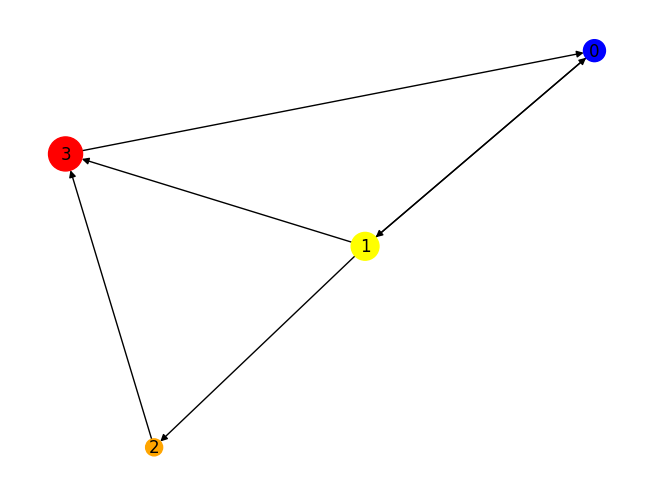
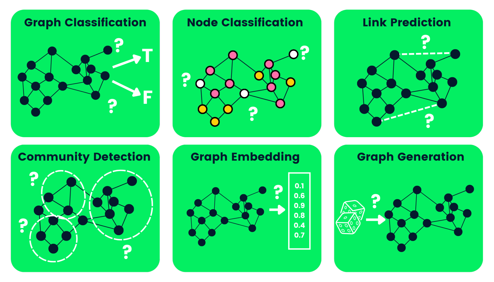

These notes heavily lean on these [tutorials](https://www.datacamp.com/tutorial/comprehensive-introduction-graph-neural-networks-gnns-tutorial).

# What's a graph?
A graph is a data structure consisting of nodes and edges, where the nodes represent some object, and edges represent relationships between objects.

# Graphs with NetworkX
`networkx` is a python library for making graphs.
In order to draw the graph, we also need `matplotlib`.

In case you haven't already, install the libraries either in the terminal or directly in `jupyter`.

In terminal:

```sh
pip install networkx matplotlib
```

In jupyter:

```python
!pip install networkx matplotlib
```

The code will go like the following:

1.   Create networkx’s **DiGraph** object “H”

```python
import networkx as nx
H = nx.DiGraph()
```

This is a directed graph object.

2.  Add nodes that contain different labels, colors, and size

```python
H.add_nodes_from([
	(0, {"color": "blue", "size": 250}),
	(1, {"color": "yellow", "size": 400}),
	(2, {"color": "orange", "size": 150}),
	(3, {"color": "red", "size": 600})
])
```

The format for each node goes:

```
(node ID, dictionary of node attributes)
```

3.  Add edges to create a relationship between two nodes. For example, “(0,1)” means that **0** has a directional dependency on **1**. We will create bidirectional relationships by adding “(1,0)”

```python
H.add_edges_from([
	(0, 1),
	(1, 2),
	(1, 0),
	(1, 3),
	(2, 3),
	(3, 0),
])
```

-   Extract colors and sizes in the form of lists

```python
node_colors = nx.get_node_attributes(H, "color").values()
colors = list(node_colors)
node_sizes = nx.get_node_attributes(H, "size").values()
sizes = list(node_sizes)
```

So here we are using `get_node_attributes` to get the values of given attributes from the graph called `H`.
For this example, the attributes have corresponding arguments when plotting, so we extract them to better see the literal attributes of the graph.

-   Plot the graph using networkx’s **draw** function

```python
nx.draw(H, with_labels=True, node_color=colors, node_size=sizes)
```

The output should end up looking something like this:



We can then also create a new undirected version of the graph using the `to_undirected` method.

```python
G = H.to_undirected()
nx.draw(G, with_labels=True, node_color=colors, node_size=sizes)
```

Which should look pretty similar but without arrows of course.

# Why is it Hard to Analyze a Graph?

Graph-based data structures have drawbacks, and data scientists must understand them before developing graph-based solutions.

1.  A graph exists in non-euclidean space. It does not exist in 2D or 3D space, which makes it harder to interpret the data. To visualize the structure in 2D space, you must use various dimensionality reduction tools.
2.  Graphs are dynamic; they do not have a fixed form. There can be two visually different graphs, but they might have similar adjacency matrix representations. It makes it difficult for us to analyze data using traditional statistical tools. 
3.  Large size and dimensionality will increase the graph's complexity for human interpretations. The dense structure with multiple nodes and thousands of edges is harder to understand and extract insights.

# What is a Graph Neural Network (GNN)?

Graph Neural Networks are special types of neural networks capable of working with a graph data structure. They are highly influenced by Convolutional Neural Networks (CNNs) and graph embedding. GNNs are used in predicting nodes, edges, and graph-based tasks. 

-   **CNNs** are used for image classification. Similarly, GNNs are applied to graph structure (grid of pixels) to predict a class. 
-   **Recurrence Neural Networks** are used in text classification. Similarly, GNNs are applied to graph structures where every word is a node in a sentence.  

GNNs were introduced when Convolutional Neural Networks failed to achieve optimal results due to the arbitrary size of the graph and complex structure.

# Types of Graph Neural Networks

There are several types of neural networks, and most of them have some variation of Convolutional Neural Networks. In this section, we will be learning about the most popular GNNs. 

-   G**raph Convolutional Networks (GCNs)** are similar to traditional CNNs. It learns features by inspecting neighboring nodes. GNNs aggregate node vectors, pass the result to the dense layer, and apply non-linearity using the activation function. In short, it consists of Graph convolution, linear layer, and non-learner activation function. There are two major types of GCNs: Spatial Convolutional Networks and Spectral Convolutional Networks.
-   **Graph Auto-Encoder Networks** learn graph representation using an encoder and attempt to reconstruct input graphs using a decoder. The encoder and decoders are joined by a bottleneck layer. They are commonly used in link prediction as Auto-Encoders are good at dealing with class balance. 
-   **Recurrent Graph Neural Networks(RGNNs)** learn the best diffusion pattern, and they can handle multi-relational graphs where a single node has multiple relations. This type of graph neural network uses regularizers to boost smoothness and eliminate over-parameterization. RGNNs use less computation power to produce better results. They are used in generating text, machine translation, speech recognition, generating image descriptions, video tagging, and text summarization.
-   **Gated Graph Neural Networks (GGNNs)** are better than the RGNNs in performing tasks with long-term dependencies. Gated Graph Neural Networks improve Recurrent Graph Neural Networks by adding a node, edge, and time gates on long-term dependencies. Similar to Gated Recurrent Units (GRUs), the gates are used to remember and forget information in different states. 

If you are interested in [learning more about Recurrent Neural Networks (RNNs)](https://www.datacamp.com/courses/recurrent-neural-networks-rnn-for-language-modeling-in-python), check out DataCamp’s course. It will introduce you to various RNNs model architectures, Keras frameworks, and RNN applications.

# Types of Graph Neural Networks Tasks

Below, we’ve outlined some of the types of GNN tasks with examples:

-   **Graph Classification**: we use this to classify graphs into various categories. Its applications are social network analysis and text classification. 
-   **Node Classification**: this task uses neighboring node labels to predict missing node labels in a graph. 
-   **Link Prediction**: predicts the link between a pair of nodes in a graph with an incomplete adjacency matrix. It is commonly used for social networks. 
-   **Community Detection**: divides nodes into various clusters based on edge structure. It learns from edge weights, and distance and graph objects similarly. 
-   **Graph Embedding**: maps graphs into vectors, preserving the relevant information on nodes, edges, and structure.
-   **Graph Generation**: learns from sample graph distribution to generate a new but similar graph structure.



# What's a Graph Convolutional Network (GCN)?

Most GNNs are or contain GCNs.
Operationally very similar to CNNs.
The difference is in the structure of the data structure, not the algorithm per se. 

It's all about taking the weighted sum of nodes local to each other.

### Two main types
* **Spatial**: using spacial features to learn from graphs in real space. Think that this might be used in a similar place as an image CNN, but maybe would be better because the image has weird, differently shaped pixels
* **Spectral**: Eigen-decomposition of graph Laplacian matrix for information propagation along nodes. These networks were inspired by wave propagation in signals and systems.


