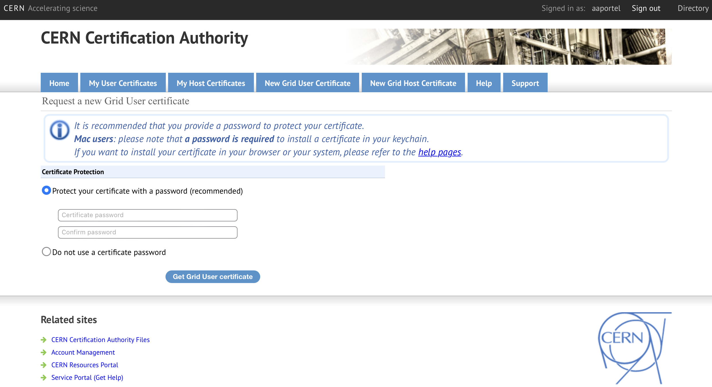

**That is the voms proxy?**
It's a command that allows us to download or otherwise access CERN's databases. 
Here is a summary of the steps:
1. get certificate
2. put in whichever host you need to access CERN data from.
	* This could be your personal computer, lpc, and/or lxplus.
3. activate as certificates.
4. run `voms-proxy-init --rfc --voms cms -valid 192:00`
You only need to do steps 1-3 once per host.
Step 4 you need to do every time your voms proxy expires.

[This official CERN twiki](https://twiki.cern.ch/twiki/bin/view/CMSPublic/WorkBookStartingGrid) is a pretty good starting place to figure out any trouble shooting you might have to do.

# 1. Get Certificate

Go to this [link](https://ca.cern.ch/ca/user/Request.aspx?template=ee2user).
It should look something like this:



Put in the password of your choice and click "Get Grid User certificate".
Once that's done, you should get to the following page.
If the certificates have not already started downloading, go ahead and click "Download certificate".


# 2. Move to host

If you are only using this on your private compute and not some `ssh` host, skip the following step

```
TODO
```

Make a hidden `.globus` folder in the home directory,

```sh
cd ~  # move to the home directory
mkdir .globus  # make a hidden globus folder
cd ~/.globus #  move into the hidden globus folder
```


Then move `myCertificate.p12` from where ever it was downloaded to your new `.globus` directory,

```sh
mv /path/to/cert/myCertificate.p12 ~/.globus
```

```sh
rm -f usercert.pem
rm -f userkey.pem
openssl pkcs12 -in myCertificate.p12 -clcerts -nokeys -out usercert.pem
openssl pkcs12 -in myCertificate.p12 -nocerts -out userkey.pem
chmod 400 userkey.pem
chmod 400 usercert.pem
```